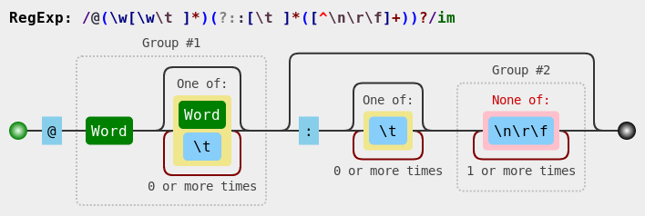

# Versum Syntax and Object Representation

[Versum](/versum/README.md) is a narrative scripting language derived from [Markdown](https://daringfireball.net/projects/markdown/), having narrative structures inspired in [Ink](https://github.com/inkle/ink/blob/master/Documentation/WritingWithInk.md).

This document describes the Versum Syntax and the respective translation of each expression to the respective **Versum Object Representation**, which is a Javascript representation of a Versum document, produced by the [Harena Translator](https://github.com/datasci4health/harena-space/tree/master/src/adonisjs/public/translator).

The Versum Object Representation is used by the Harena Authoring and Player environments to edit and interpret the scripts. The translator also uses this representation to generate HTML rendered in the browser.

Regular expressions checked through [RegExr](https://regexr.com/).
Regular expression images generated by [Regulex](https://jex.im/regulex/).

# Case
* Object:
```
{
   name:  <case name>,
   start: <knot that starts the case>,
   knots: {<set of knots in the case>}
}
```

# Knot
### Markdown to Object
* Sentence:
```
## [title] ([category],..,[category]) ##
```
or
```
[title] ([category],..,[category])
=====
```             
* Expression: `(?:^[ \t]*(#+)[ \t]*([^\( \t\n\r\f][^\(\n\r\f]*)(?:\((\w[\w \t,]*)\))?[ \t]*#*[ \t]*$)|(?:^[ \t]*([^\( \t\n\r\f][^\(\n\r\f]*)(?:\((\w[\w \t,]*)\))?[ \t]*[\f\n\r][\n\r]?(==+|--+)$)`
  * Group #1 or Group #6: level of the knot (acordding to the number of # or the underline type === or ---)
  * Group #2 or Group #4: title
  * Group #3 or Group #5: [categories]

* Object:
```
{
   type: "knot"
   title: <title of the knot>
   categories: [<set of categories>]
   level: <level of the knot>
   content: [<elements subordinated to this knot>]
   annotations: [<set of annotations]
}
```

# Annotations

## Context
* Sentence context open: `{{ [context] / [related input] /`
* Expression context open: `\{\{([\w \t\+\-\*\."=\:%]+)?(?:\/([\w \t\.]+)\/)?[\f\n\r]`
  * Group #1: context
  * Group #2: related input

* Sentence context close: `}}`
* Expression context close: `\}\}` 

* Object:
```
{
   type: "context"
   context: <identification of the context>
   input: <variable of a related input>
   annotations: [<set of annotations in this context>]
}
```

## Annotation
* Sentence outside: `{ [natural] ([formal]) } / [context value] /`
* Expression outside: `\{([^\(\{\}\/]+)\}(?:\(([^\)]+)\))?(?:\/([^\/]+)\/)?`
  * Group #1: natural
  * Group #2: formal
  * Group #3: context value (intended for evaluations based on selects)

* Sentence inside: `[expression] =|: [specification] / [rate]`
* Expression inside: `([\w \t\+\-\*"]+)(?:[=\:]([\w \t%]*)(?:\/([\w \t%]*))?)?`
  * Group #1: expression
  * Group #2: specification
  * Group #3: rate

* Object:
```
{
   type: "domain"
   natural: {
      complete: <complete text in natural language>
      expression: <expression in the text to be evaluated>
      specification: <specify the expression defining, for example, a measurable value, rate or origin>
      rate: <compose the rate of the specification>
   }
   formal: {
      complete: <complete text written in formal way to be recognized against a dictionary>
      expression: <expression in the text to be evaluated>
      specification: <specify the expression defining, for example, a measurable value, rate or origin>
      rate: <compose the rate of the specification>
   }
   value: <value of the expression according to the context> 
}
```

# Items

## Text
* Sentence: `([ \t]*)([^\f\n\r]+)$`
            or
            `<markdown text that does not match to any expression>`
* Object:
```
{
   type: "text"
   subordinate: <subordination according to spaces preceeding>
   content: <unprocessed content in markdown>
}
```
### Object to HTML
```
<unprocessed content in markdown>
```
This content is further converted to HTML by the compiler.

## Image
### Markdown to Object
* Sentence: `!\[alt-text\]([path] "[title]")`
* Expression: `([ \t]*)!\[([\w \t]*)\]\(([\w:.\/\?&#\-]+)[ \t]*(?:"([\w ]*)")?\)`
  * Group #1: subordinate 
  * Group #2: alt text
  * Group #3: image path
  * Group #4: image title

* Object:
```
{
    type:  "image"
    subordinate: <subordination according to spaces preceeding>
    alternative:   <alt text>
    path:  <image path>
    title: <image title>
}
```
### Object to HTML
```

```

## Option
### Markdown to Object
* Sentence: `+ [label] ([rule]) -> [target]` or `* [label] ([rule]) -> [target]([parameter])`
* Expression: `^[ \t]*([\+\*])[ \t]*([^\(&> \t][^\(&>\n\r\f]*)?(?:\(([\w \t-]+)\)[ \t]*)?(?:-(?:(?:&gt;)|>)[ \t]*([^\(\n\r\f]+)(?:\(([^\)\n\r\f]+)\))?)$`
  * Group #1: subtype
  * Group #2: label
  * Group #3: rule
  * Group #4: target
  * Group #5: parameter

* Object:
```
{
   type: "option"
   subtype: "+" or "*"
   label: <label to be displayed -- if there is no explicit label, the target is the label>
   rule:  <rule of the trigger -- determine its position in the knot>
   target: <resolved target -- if there is not an explicit target, the label is the target>
   parameter: <parameter for the target knot>
}
```
`<resolved target>` - target after resolving relative links.
### Object to HTML
```
<dcc-trigger id='dcc[seq]' type='[subtype]' action='[target]' label='[display]' [image][location]></dcc-trigger>
```

## Field
### Markdown to Object
* Sentence: `+ [field]: [value] -> [target]` or `* [field]: [value] -> [target]`
* Expression: `^([ \t]*)(?:[\+\*])[ \t]*([\w.\/\?&#\-][\w.\/\?&#\- \t]*):[ \t]*([^&>\n\r\f]+)(?:-(?:(?:&gt;)|>)[ \t]*([^\(\n\r\f]+))?$`
  * Group #1: subordinate
  * Group #2: field
  * Group #3: value
  * Group #4: target

* Object:
```
{
   type: "field"
   presentation: <unprocessed content in markdown>
   subordinate: <subordination according to spaces preceeding>
   field: <label of the field>
   value: <value of the field>
   target: <target triggered when the state/value is achieved>
}
```
### Object to HTML
```
<unprocessed content in markdown>
```
This content is further converted to HTML by the compiler.

## Divert
### Markdown to Object
* Sentence: `-> [target]`
* Expression: `-(?:(?:&gt;)|>) *(\w[\w. ]*)`
  * Group #1: target

* Object:
```
{
   type: "divert",
   label: <target>
   target: <resolved target>
}
```
`<resolved target>` - target after resolving relative links.
### Object to HTML
```
<dcc-trigger id='dcc[seq]' action='[target]' label='[display]'></dcc-trigger>
```

## Talk
### Markdown to Object
* Sentence: `@[character]: [speech]`
  * subordinated:
    ~~~
    !\[alt-text\]([image path] "[title]")
    [speech]
    ~~~
* Expression: `@(\w[\w \t]*)(?::[ \t]*([^\n\r\f]+))?`
  * Group #1: character
  * Group #2: speech

* Object:
```
{
   type: "talk"
   character: <identification of the character>
   speech: <character's speech>
   image: {
      alternative: <alt text>
      path:  <image path>
      title: <image title>
   }
}
```
### Object to HTML
```
<dcc-talk id='dcc[seq]' character='[character]'>
  [speech]
</dcc-talk>
```

## Input
### Markdown to Object
* Sentence set:
  * first line: `? [variable]`
  * subordinated:
    ~~~
    * type: [input subtype]
    * rows: [rows]
    * vocabularies: [vocabulary], ..., [vocabulary]
    * right answers: [right answer], ..., [right answer] -> [target]
    * wrong answers: [wrong answer], ..., [wrong answer] -> [target]
    * [type] answers: [answer], ..., [answer] -> [target]
    * answers: [answer], ..., [answer] -> [target]
    ~~~
* Expression: `^\?[ \t]+([\w \t]+)$`
  * Group #1: variable

* Object:
```
{
   type: "input"
   subtype: <input subtype>
   variable: <variable that will receive the input>
   rows: <number of rows for the input>
   vocabularies: [<set of vocabularies to interpret the input>]
   answers: {
     <type>: {
       answers: [<set of answers>],
       target: <target to divert for the answer>
     },
     right: {...},
     wrong: {...},
     untyped: {...}
   }
}
```
### Object to HTML
**Standard**
```
<dcc-input id='dcc[seq]' variable='[variable]'[rows][vocabularies]> 
</dcc-input>
```
**Group Select subtype**
```
<dcc-group-select id='dcc[seq]' [author] context='[context]' input='[input]''>
<dcc-group-select id='dcc[seq]' [author] variable='[variable]' states='[state],...,[state]' labels='[label],...,[label]'>
</dcc-group-select>
```

## Output
### Markdown to Object
* Sentence: `^[variable]([variant])^`
* Expression: `\^([\w \t\.]+)(?:\(([\w \t]+)\))?\^`
  * Group #1: variable
  * Group #2: variant

* Object:
```
{
   type: "output"
   variable: <variable name>
   variant: <variant of the variable>
}
```
The existing `variant` is "`right`", meaning that the output will be the right value attributed to the variable, instead of the value imputed by the player.
### Object to HTML
```
<dcc-expression expression='[variable]'></dcc-expression>
```

## Compute
### Markdown to Object
* Sentence: `~ [variable] +|-|*|/|= [number]`
* Expression: `~[ \t]*(\w+)?[ \t]*([\+-=])[ \t]*(\d+(?:\.\d+)?)`
  * Group #1: variable
  * Group #2: operator
  * Group #3: value

* Object:
```
{
   type: "compute"
   variable: <variable name>
   operator: +|-|*|/|=
   value: <value>
}
```
### Object to HTML
```
<dcc-compute sentence='[sentence]'></dcc-compute>
```

## Select Context
### -- Open
### Markdown to Object
* Sentence context open: `{{ [context] / [related input] /`
* Expression context open: `\{\{([\w \t\+\-\*\."=\:%]+)?(?:\/([\w \t\.]+)\/)?[\f\n\r]`
  * Group #1: context
  * Group #2: related input

* Object:
```
{
   type: "context-open"
   context: <identification of the context> #1
   input: <variable of a related input> #2
}
```
### Object to HTML
```
no HTML
```
### -- Close
### Markdown to Object
* Sentence context close: `}}`
* Expression context close: `\}\}` 

* Object:
```
{
   type: "context-close"
}
```
### Object to HTML
```
no HTML
```

## Select
* Sentence: `{ [natural] ([formal]) } / [context value] /`
* Expression: `\{([^\(\{\}\/]+)\}(?:\(([^\)]+)\))?(?:\/([^\/]+)\/)`
  * Group #1: natural
  * Group #2: formal (extracted in an annotation)
  * Group #3: context value

* Object:
```
{
   type: "select"
   expression: <expression to be evaluated (natural)>
   value: <right value of the expression according to the evaluated context>
}
```
### Object to HTML
```
<dcc-state-select id='dcc[seq]'>[expression]</dcc-state-select>
```

## Line feed
* Sentence: `\f` or `\r` or `\n`
* Expression: `[\f\n\r]+`

* Object:
```
{
   type: "linefeed"
   content: <line feeds>
}
```
### Object to HTML
Each line feed is converted to `<br>`