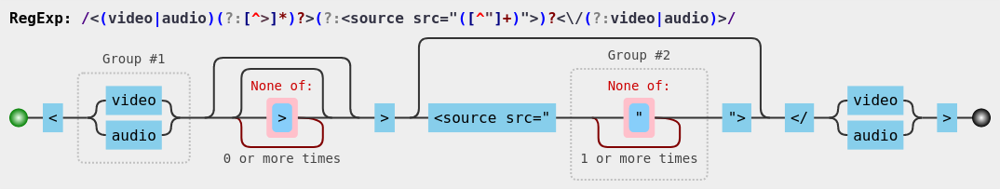

<!-- Jekyll directive to avoid Liquid filters

-->

# Versum Syntax and Object Representation

[Versum](/versum/README.md) is a narrative scripting language derived from [Markdown](https://daringfireball.net/projects/markdown/), having narrative structures inspired in [Ink](https://github.com/inkle/ink/blob/master/Documentation/WritingWithInk.md).

This document describes the Versum Syntax and the respective translation of each expression to the respective **Versum Object Representation**, which is a Javascript representation of a Versum document, produced by the [Harena Translator](https://github.com/datasci4health/harena-space/tree/master/src/adonisjs/public/translator).

The Versum Object Representation is used by the Harena Authoring and Player environments to edit and interpret the scripts. The translator also uses this representation to generate HTML rendered in the browser.

Reference to build regular expressions: [MDN Regular Expressions](https://developer.mozilla.org/en-US/docs/Web/JavaScript/Guide/Regular_Expressions).
Regular expressions checked through [RegExr](https://regexr.com/).
Regular expression images generated by [Regulex](https://jex.im/regulex/).

# Case
* Object:

~~~
{
   name:  <case name>,
   start: <knot that starts the case>,
   knots: {<set of knots in the case>}
}
~~~

# Layer
### Markdown to Object
* Sentence:

~~~
__ [title] __
~~~

* Expression: `^[ \t]*\_{2,}((?:.(?!\_{2,}))*.)(?:\_{2,})?[ \t]*$`
  * Group #1: title

# Knot
### Markdown to Object
* Sentence:

~~~
## [title] ([category],..,[category]): [inheritance] ##
~~~

or

~~~
=====
[title] ([category],..,[category]): [inheritance]
=====
~~~             

* Expression: `(?:^[ \t]*(#+)[ \t]*([^\( \t\n\r\f\:#][^\(\n\r\f\:#]*)(?:\((\w[\w \t,]*)\))?[ \t]*(?:\:[ \t]*([^\(\n\r\f#][^\(\n\r\f\t#]*))?[ \t]*(#+)?[ \t]*$)|^(?:(==+|--+)[\f\n\r][\n\r]?)?(?:[ \t]*([^\( \t\n\r\f\:][^\(\n\r\f\:]*)(?:\((\w[\w \t,]*)\))?[ \t]*(?:\:[ \t]*([^\(\n\r\f][^\(\n\r\f\t]*))?[ \t]*[\f\n\r][\n\r]?(==+|--+)$)`
  * Group #1 or Group #10: level of the knot (acordding to the number of # or the underline type === or ---)
  * Group #2 or Group #7: title
  * Group #3 or Group #8: [categories]
  * Group #4 or Group #9: inheritance
  * Group #5 or Group #6: unity knot mark

* Object:

~~~
{
   type: "knot"
   title: <title of the knot>
   categories: [<set of categories>]
   inheritance: <inherited knot>
   level: <level of the knot>
   content: [<elements subordinated to this knot>]
   annotations: [<set of annotations]
}
~~~

# Annotations

## Context
* Sentence context open: `{{ [namespace:context] @[id] / [namespace:property] [namespace:value] /`
* Expression context open: `\{\{(?:([^\:\n\r\f]+)\:)?([\w \t\+\-\*\."=%]+)?(?:@(\w+))?(?:\/([\w \t\.\:]+)\/)?$`
  * Group #1: namespace
  * Group #2: context qualification
  * Group #3: context id
  * Group #4: related input property
  * Group #5: related input value

* Sentence context close: `}}`
* Expression context close: `\}\}`

* Object:

~~~
{
   type: "context"
   namespace: <namespace of the context>
   context: <qualification of the context>
   id: <identification of the context>
   property: <property of a related input>
   value: <value of a related input>
   annotations: [<set of annotations in this context>]
}
~~~

## Annotation
* Sentence outside: `{ [natural] } ([formal])`
* Expression outside: `\{([^\}\n\r\f]+)\}(?:\(([^\)\n\r\f]+)\))?`
  * Group #1: natural
  * Group #2: formal
  * Group #3: context value (intended for evaluations based on selects)

* Sentence inside: `[expression] =|: [specification] / [rate]`
* Expression inside: `(?:([^\:\n\r\f]+)\:)?([^=\n\r\f]+)(?:=([\w \t%]*)(?:\/([\w \t%]*))?)?`
  * Group #1: namespace
  * Group #2: expression
  * Group #3: specification
  * Group #4: rate

* Object:

~~~
{
   type: "domain"
   natural: {
      complete: <complete text in natural language>
      expression: <expression in the text to be evaluated>
      specification: <specify the expression defining, for example, a measurable value, rate or origin>
      rate: <compose the rate of the specification>
   }
   formal: {
      complete: <complete text written in formal way to be recognized against a dictionary>
      namespace: <namespace of the expression>
      expression: <expression in the text to be evaluated>
      specification: <specify the expression defining, for example, a measurable value, rate or origin>
      rate: <compose the rate of the specification>
   }
   value: <value of the expression according to the context>
}
~~~

# Items

## Text
* Sentence: `([ \t]*)([^\f\n\r]+)$`
            or
            `<markdown text that does not match to any expression>`
* Object:

~~~
{
   type: "text"
   subordinate: <subordination according to spaces preceeding>
   content: <unprocessed content in markdown>
}
~~~

### Object to HTML

~~~
<unprocessed content in markdown>
~~~

This content is further converted to HTML by the compiler.

## Blockquote
### Markdown to Object
* Sentence: `> `
* Expression: `^[ \t]*>[ \t]*`

* Object:

~~~
{
   type: "blockquote"
   content: blockquote
}
~~~

### Object to HTML
If it is not subordinated, it is transformed into an HTML blockquote.

## Image
### Markdown to Object
* Sentence: `!\[alt-text\]([path] =widthxheight "[title]")`
* Expression: `([ \t]*)!\[([\w \t]*)\]\(<?([\w:.\/\?&#\-~]+)>?[ \t]*(?:=(\d*(?:\.\d+[^x \t"\)])?)(?:x(\d*(?:\.\d+[^ \t"\)])?))?)?[ \t]*(?:"([\w ]*)")?\)`
  * Group #1: subordinate
  * Group #2: alt text
  * Group #3: image path
  * Group #4: image width
  * Group #5: image height
  * Group #6: image title

* Object:

~~~
{
    type:  "image"
    subordinate: <subordination according to spaces preceding>
    alternative:   <alt text>
    path:  <image path>
    title: <image title>
}
~~~

### Object to HTML

~~~

~~~

## Media
### Markdown to Object
* Sentence: `<video><source src="[path]"></video>` or `<audio><source src="[path]"></audio>`
* Expression: `<(video|audio)(?:[^>]*)?>(?:<source src="([^"]+)">)?<\/(?:video|audio)>`
  * Group #1: video or audio
  * Group #2: media path

* Object:

~~~
{
    type:  "media"
    subtype: "video" or "audio"
    path:  <media path>
}
~~~

### Object to HTML

~~~
<video><source src="[path]"></video>
<audio><source src="[path]"></audio>
~~~

## Option
### Markdown to Object
* Sentence: `+ [label] ->|<->|(-) [target] "[message]"` or `* [label] ->|<->|(-) [target] "[message]" >((state))?`
* Expression: `^[ \t]*([\+\*])[ \t]+([^&<> \t\n\r\f][^&<>\n\r\f]*)?((?:(?:(?:&lt;)|<)?-(?:(?:&gt;)|>))|(?:\(-\)))[ \t]*([^"\n\r\f(]+)(?:"([^"\n\r\f]*)")?[ \t]*(?:(\>)?\(\(([^)]*)\)\))?(\?)?[ \t]*$`
  * Group #1: subtype
  * Group #2: label
  * Group #3: divert type
  * Group #4: target
  * Group #5: message
  * Group #6: state change
  * Group #7: state
  * Group #8: state test

* Object:

~~~
{
   type: "option"
   subtype: "+" or "*"
   label: <label to be displayed -- if there is no explicit label, the target is the label>
   divert: <divert type "forward", "round", or "enclosed">
   target: <resolved target -- if there is not an explicit target, the label is the target>
   message: <message for the target knot>
   state: new state or state tested
   operation: ">" or "?"
}
~~~

`<resolved target>` - target after resolving relative links.

### Object to HTML

~~~
<dcc-button id='dcc[seq]'[author] type='[subtype]' topic='knot/[target]/navigate' label='[display]'[message][image]></dcc-button>
~~~

## Field
### Markdown to Object
* Sentence: `* [field]: [value] -> [target]` or `* '[field]': '[value]' -> [target]`
* Expression: `^([ \t]*)(?:[\+\*])[ \t]+((?:[\w.\/\?&#\-][\w.\/\?&#\- \t]*)|(?:'[^']*')[ \t]*):[ \t]*([^&>\n\r\f'][^&>\n\r\f]*)?(?:'([^']*)')?(?:-(?:(?:&gt;)|>)[ \t]*([^\(\n\r\f]+))?$`
  * Group #1: subordinate
  * Group #2: field
  * Group #3: value without quotes
  * Group #4: value with quotes
  * Group #5: target

* Object:

~~~
{
   type: "field"
   presentation: <unprocessed content in markdown>
   subordinate: <subordination according to spaces preceeding>
   level: <level of subordination (if subordinate)>
   field: <label of the field without quotes>
   quotes: <field has quotes - to generate it in the same way>
   value: <value of the field>
   target: <target triggered when the state/value is achieved>
}
~~~

The level of subordination is calculated as follows: for each tab or two spaces preceding the field, it counts one.

Fields are grouped according to the subordination, i.e., if one field B succeeds another field B and B has a level of subordination greater than A, B becomes a field of the value of A.

### Object to HTML

~~~
<unprocessed content in markdown>
~~~

This content is further converted to HTML by the compiler.

## Divert
### Markdown to Object
* Sentence: `[label] ->|<->|(-) [target] | "[target]"`
* Expression: `(?:([^&<> \t\n\r\f][^&<> \t\n\r\f]*)|"([^"]+)")(?:[ \t])*((?:(?:(?:&lt;)|<)?-(?:(?:&gt;)|>))|(?:\(-\)))[ \t]*(?:(\w[\w.]*)|"([^"]*)")`
  * Group #1: label (without quotes)
  * Group #2: label (with quotes)
  * Group #3: divert type
  * Group #4: target (without quotes)
  * Group #5: target (with quotes)

* Object:

~~~
{
   type: "divert",
   label: <label>,
   divert: <divert type "forward", "round", or "enclosed">
   target: <resolved target>
}
~~~

`<resolved target>` - target after resolving relative links.

### Object to HTML

~~~
<dcc-button id='dcc[seq]' topic='knot/[target]/navigate' label='[display]'></dcc-button>
~~~

## Divert Script
### Markdown to Object
* Sentence: `-> [target] "[parameter]"`
* Expression: `^[ \t]*-(?:(?:&gt;)|>)[ \t]*([^"\n\r\f]+)(?:"([^"\n\r\f]+)")?[ \t]*$`
  * Group #1: target
  * Group #2: parameter

* Object:

~~~
{
   type: "divert-script"
   target: <resolved target>
   parameter: <parameter for the target knot>
}
~~~

`<resolved target>` - target after resolving relative links.

### Object to HTML

~~~
-> [target] "[parameter]"
~~~

## Entity
### Markdown to Object
* Sentence: `@[entity]: [speech]`
  * subordinated:
    ~~~
    !\[alt-text\]([image path] "[title]")
    [speech]
    ~~~
* Expression: `@(?:(\w[\w \t]*)|"([\w \t]*)")(?:$|:[ \t]*)`
  * Group #1: entity (without quotes)
  * Group #2: entity (with quotes)
  * Group #3: speech

* Object:

~~~
{
   type: "entity"
   entity: <identification of the entity>
   speech: <character's speech>
   image: {
      path:  <image path>
      alternative: <alt text>
      title: <image title>
   }
}
~~~

### Object to HTML

~~~
<dcc-entity id='dcc[seq]' entity='[entity]' image='[path]' alternative='[alternative]' title='[title]'>
  [speech]
</dcc-entity>
~~~

## Mention
### Markdown to Object
* Sentence: `@[entity]`
* Expression: `@(?:(\w+)|"([\w \t]*)")`
  * Group #1: character (without quotes)
  * Group #2: character (with quotes)
 [talk Expression](expressions/mention.png)
* Object:

~~~
{
   type: "mention"
   character: <identification of the character>
}
~~~

### Object to HTML

~~~
<b>[character]</b>
~~~

## Input
### Markdown to Object
* Sentence set:
  * first line: `? [variable]`
  * subordinated:
    ~~~
    [statement]
    * type: [input subtype]
    * rows: [rows]
    * vocabularies: [vocabulary], ..., [vocabulary]
    * right answers: [right answer], ..., [right answer] -> [target]
    * wrong answers: [wrong answer], ..., [wrong answer] -> [target]
    * [type] answers: [answer], ..., [answer] -> [target]
    * answers: [answer], ..., [answer] -> [target]
    ~~~
* Expression: `^\?[ \t]+([\w \t]+)$`
  * Group #1: variable

* Subtypes: short, text, group select
* Object:

~~~
{
   type: "input"
   subtype: <input subtype>
   variable: <variable that will receive the input>
   text: <textual statement to request the input>
   rows: <number of rows for the input>
   vocabularies: [<set of vocabularies to interpret the input>]
   answers: {
     <type>: {
       answers: [<set of answers>],
       target: <target to divert for the answer>
     },
     right: {...},
     wrong: {...},
     untyped: {...}
   }
}
~~~

### Object to HTML
**Standard**

~~~
<dcc-input id='dcc[seq]' variable='[variable]'[rows][vocabularies]>
</dcc-input>
~~~

**Group Select subtype**

~~~
<dcc-group-select id='dcc[seq]' [author] context='[context]' input='[input]''>
<dcc-group-select id='dcc[seq]' [author] variable='[variable]' states='[state],...,[state]' labels='[label],...,[label]'>
</dcc-group-select>
~~~

## Output
### Markdown to Object
* Sentence: `^[variable]([index])([variant])^`
* Expression: `\^([\w \t\.]+)(?:\[([\w \t]+)\])?(?:\(([\w \t]+)\))?\^`
  * Group #1: variable
  * Group #2: index
  * Group #3: variant

* Object:

~~~
{
   type: "output"
   variable: <variable name>
   index: <variable index - when array> starting in 1
   variant: <variant of the variable>
}
~~~

The existing `variant` is "`right`", meaning that the output will be the right value attributed to the variable, instead of the value imputed by the player.

### Object to HTML

~~~
<dcc-expression expression='[variable]'></dcc-expression>
~~~

## Compute
### Markdown to Object
* Sentence: `~ [expression]?`
* Expression: `~[ \t]*([\w+\-*/= :<>\t]+)(\?)?`
  * Group #1: expression
  * Group #2: question mark

When the expression has only one statement and it does not have an assignment, it considers that the assignment will be for the first variable. This expression assigns the result of this expression to `x`: `x+2`
* Object:

~~~
{
   type: "compute"
   expression: <expression>
   conditional: true|false
}
~~~

### Object to HTML

~~~
<dcc-compute expression='[expression]'></dcc-compute>
~~~

## Select Context
### -- Open
### Markdown to Object
* Sentence context open: `{{ [context] / [related input] /`
* Expression context open: `\{\{(?:([^\:\n\r\f]+)\:)?([\w \t\+\-\*\."=%]+)?(?:@(\w+))?(?:\/([\w \t\.\:]+)\/)?$`
  * Group #1: namespace
  * Group #2: context
  * Group #3: context id
  * Group #4: related input

* Object:

~~~
{
   type: "context-open"
   context: <identification of the context> #1
   input: <variable of a related input> #2
}
~~~

### Object to HTML

~~~
no HTML
~~~

### -- Close
### Markdown to Object
* Sentence context close: `}}`
* Expression context close: `\}\}`

* Object:

~~~
{
   type: "context-close"
}
~~~

### Object to HTML

~~~
no HTML
~~~

## Select
* Sentence: `{ [natural] } ([formal]) / [context value] /`
* Expression: `\{([^\}\n\r\f]+)\}(?:\(([^\)\n\r\f]+)\))?(?:\/([^\/\n\r\f]+)\/)`
  * Group #1: natural
  * Group #2: formal (extracted in an annotation)
  * Group #3: context value

* Object:

~~~
{
   type: "select"
   expression: <expression to be evaluated (natural)>
   value: <right value of the expression according to the evaluated context>
}
~~~

### Object to HTML

~~~
<dcc-state-select id='dcc[seq]'>[expression]</dcc-state-select>
~~~

## Line feed
* Sentence: `\f` or `\r` or `\n`
* Expression: `[\f\n\r]+`

* Object:

~~~
{
   type: "linefeed"
   content: <line feeds>
}
~~~

### Object to HTML
Each line feed is converted to ` `

<!-- Jekyll directive to avoid Liquid filters

-->
